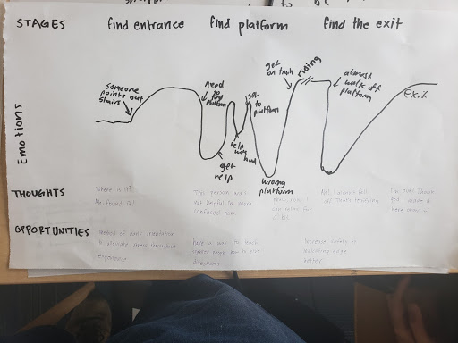
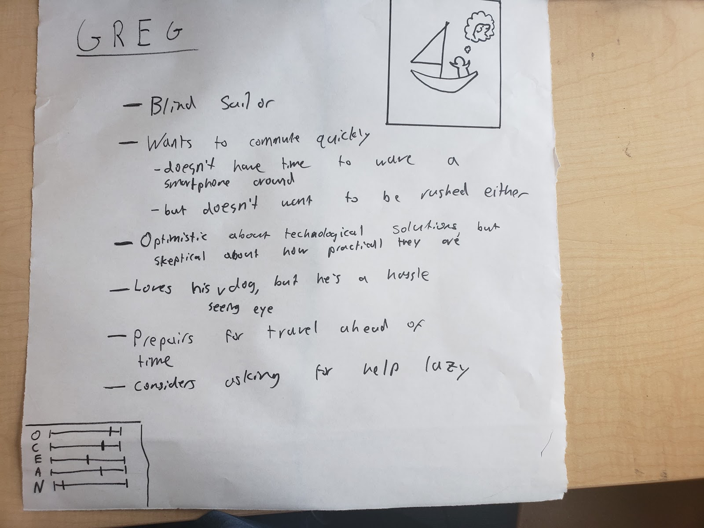
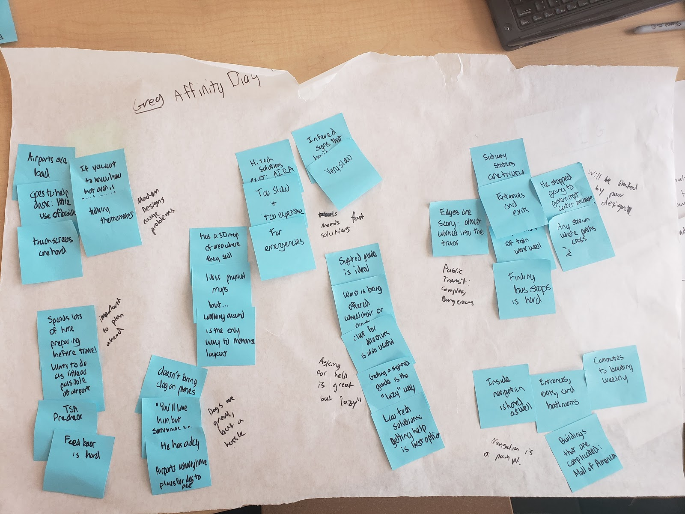

## Design Brief
### The Problem and For Whom
Public transit is halfway to anywhere, and is currently an obstacle for people who are blind. Even sighted people have some trouble navigating Park Street, but for a person who is blind locating the entrance, correct platform, the bathroom, or the exit can be a real struggle. Additionally, the threat of walking into a moving train or falling off the platform is constantly looming in the background. We heard a story from one person who is blind who suddenly found his cane in mid air while walking, hanging over the edge of the platform, which inspired him to get a seeing eye dog and stop relying on his cane in the subway. Others decide that public transit is too intimidating for use alone or at all. Highly technical solutions to public navigation exist, but these solutions are expensive and only slightly better than existing products. Navigating familiar spaces is easier than novel ones, but can still pose issues since their layout may change without notice. 

T-Stop experience map

Through defining and exploring our problem, we have learned a lot about the key stakeholders. First, successful design starts and ends with visually impaired commuters. Also, in this phase of the project we learned that the relatives and friends of the visually impaired who are most likely to be acting as sighted guides are critical stakeholders. Sighted guides are currently the most significant resource that the blind use while travelling. One of our sources told us that he always brings a sighted guide when travelling to new places. It will be important for us to consider sighted guides in the design process, because any new solution needs to integrate with existing solutions successfully.

Person portrait of Greg, a blind sailor who would benefit from our solution

### Current Solutions and Our Approach
Our users view public transit and, more generally, navigation as intimidating, scary, and sometimes completely inaccessible. For a blind person, daily life involves balancing what needs to get done with what is possible and easy. If an impaired person, Greg, needs to run errands, he first needs to thoroughly plan out his route and plan. Whereas people with sight can adapt to their environment and the possibility of going off route, for blind people going off route can mean getting hopelessly, and dangerously, lost. One of our sources relayed a story of a girl who took a wrong turn on the way from a dorm to a classroom and had to call for help. Existing solutions such as canes and dogs are useful for detecting short-range obstacles, they are less useful in getting an idea of surroundings or, for example, finding the stairs to the red line when the only indication of the red line is a red wall.

One person with whom we spoke knew about a lot of high tech solutions for blind navigation, but found them mostly infeasible. They take too long to use while traveling, or are too expensive. He has a seeing eye dog, whom he loves, but thinks that the dog is too much of a hassle to bring on longer trips. He made it clear that we need to understand the existing solutions in this area, so as to avoid reinventing the wheel, or worse yet reinventing something that already failed. The best solution he uses for navigation when things go wrong is asking for help, and we need to understand that we will not make a more versatile navigation aid than a human helper just by throwing technology at the problem.

Similarly, Paul Ruvolo warned against using technology to solve a problem or improve something when it is not needed; he told us that many people have tried to improve mobility canes by adding more sensors or other indicators, but none of them have persisted. With this in mind, we will approach this problem with an open mind for solutions that only have essential elements and are minimally reliant on technology. 

Despite the challenges of navigation, autonomy is an important word for the visually impaired. There is very little that is more valuable than the ability to go places without assistance. Our research tells us that blind people are willing to invest a lot of time and money to have this freedom. However, considering the difficulties of travel, some people give up on using public transportation at all. As painful as it is to not have the flexibility that they might want, venturing into the underground can mean risking life and limb for some. 

### Defining a Successful Solution
Our solution would need to accomplish the following things based on what we’ve learned from our interviews so far: 
* Orients the user in the space so that they know where they are and where everything is
* Reduces the amount of time spent navigating the station
* Reduces the stress and anxiety involved around using public transportation

Our solution would also have to fulfill the following requirements:
* Does not involve the use of a touch screen. One of our sources spoke at length about the inconveniences associated with touch screens, which are not accessible by the blind
* Be inexpensive to use or implement
* Properly indicate the locations of the entrance, correct platform, the bathroom, and the exit
* Be applicable to a specific problem faced by people who are blind. As both Paul Ruvolo and Alex Morrow both said, there are a lot of people working on all encompassing solutions to this problem, so there is a danger associated with getting caught up in trying to do too much. We seek to improve this pain point by solving a very specific part of the problem, addressing an obvious hole in accessibility that is more likely to be overlooked. 

Affinity Diagram indicating need and desire for fast solutions and existence of transportation pain point

### Impact
In all of our interviews so far, the overwhelming problem of transportation using public transit has been brought up unprompted. From the story of the blind man with a guide dog standing in the street long after the uber they had ordered had driven away without him, having seen the dog and decided against a pick up, to the blind sailor who almost fell onto a subway track, public transit is easily one of the most inaccessible resources for the visually impaired. Generally, we want to increase usage of and confidence in the Boston public transit system among the visually impaired. A successful solution will remove barriers associated with the use of public transit by the visually impaired in some way. A solution to this problem would make subway navigation possible for blind people without a dog or sighted guide. Instead of fearing for his life, Greg would be able to travel in the subway as a normal part of his routine. He would appreciate the subway, for the first time, as the indispensable tool we all know it to be. 

## [Homepage](index.md)

