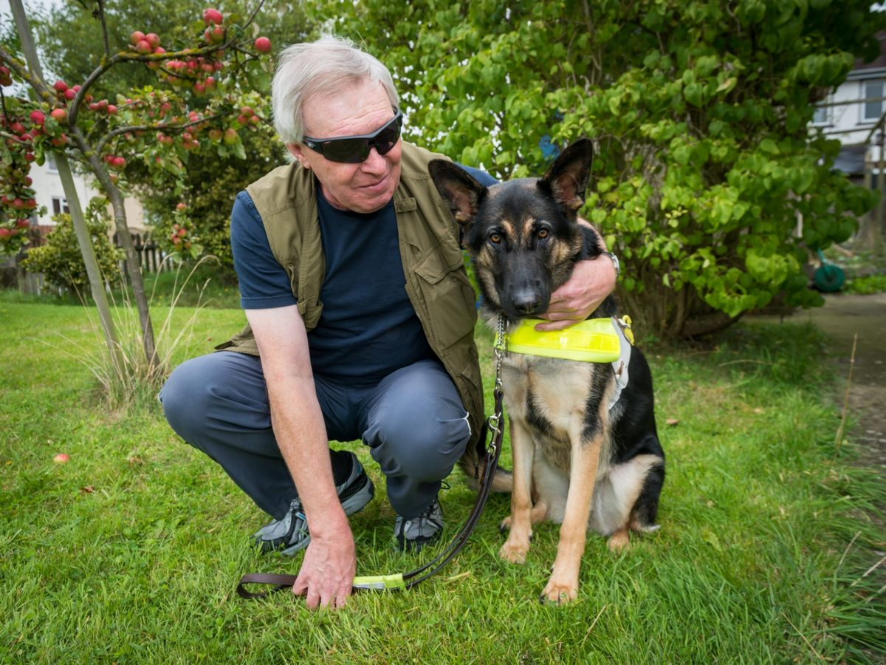
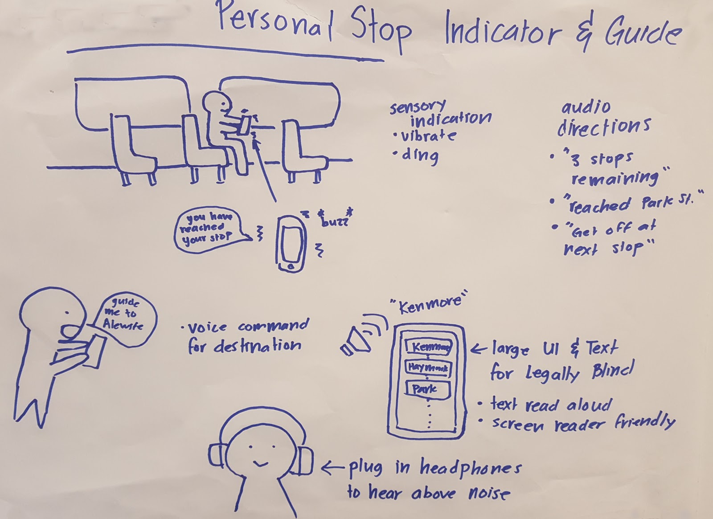
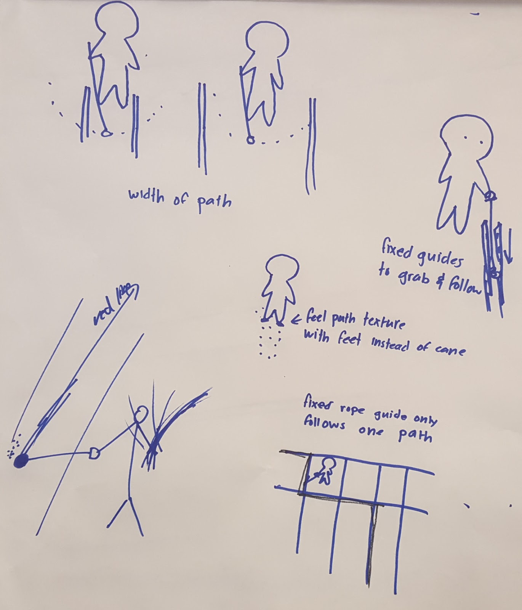
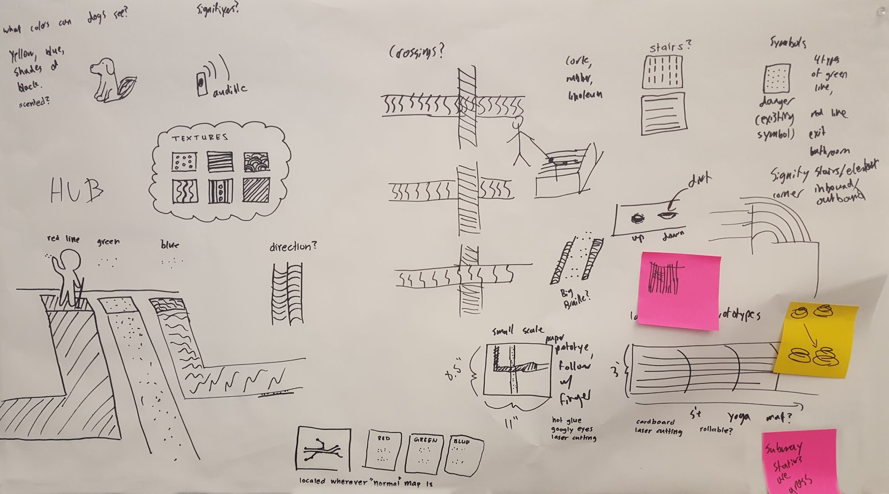
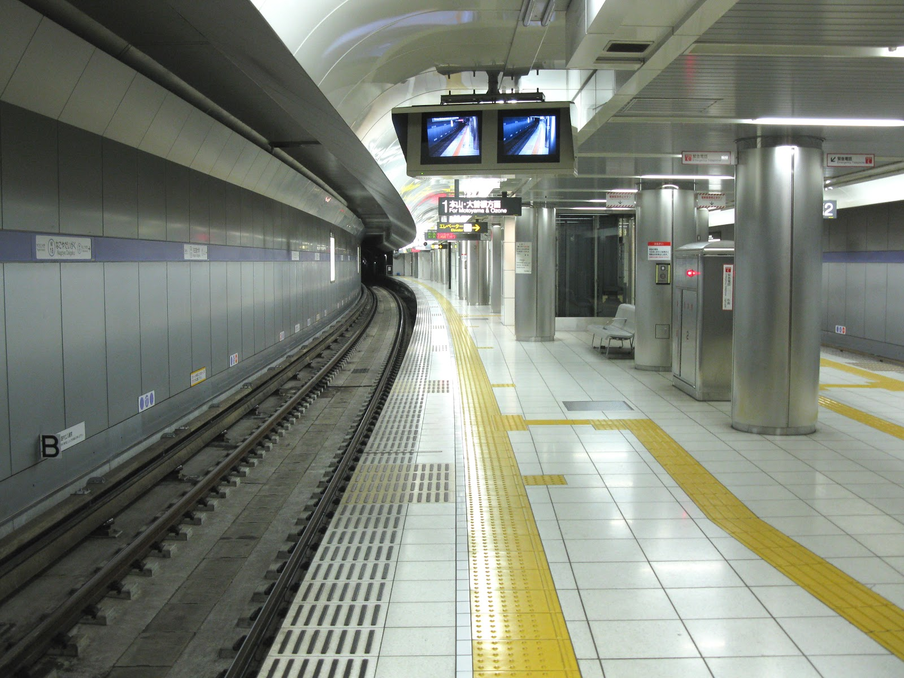
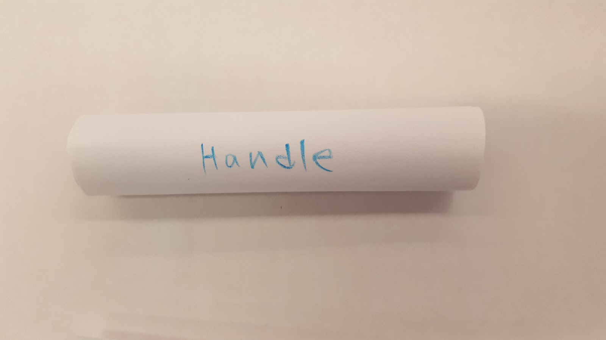
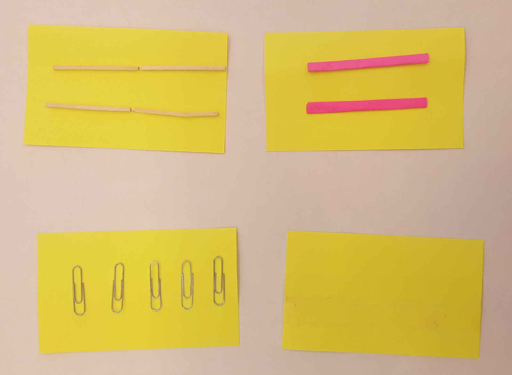
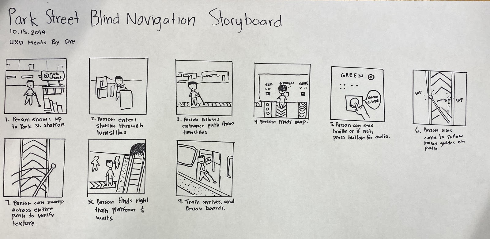
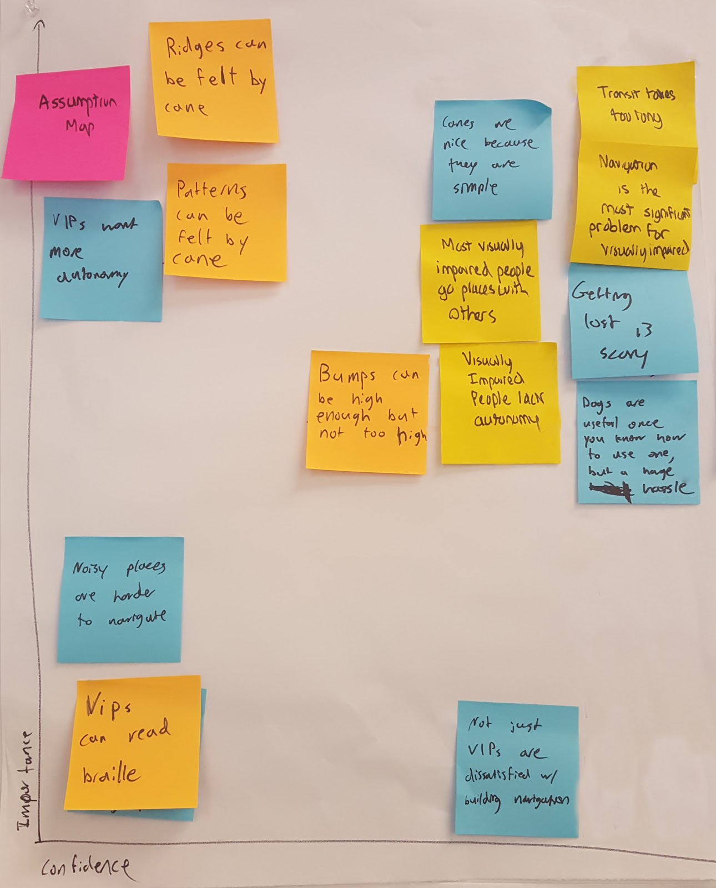
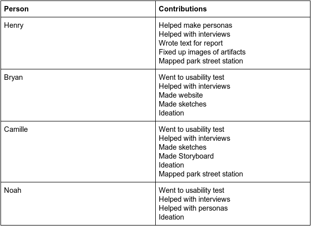

# Design Development Brief
After interviewing two experts with experience in design for people with blindness and two people with blindness, we 
created two personas who we felt represented our users.

## Personas:

### Dog Lover Dave:
* ~60 years old
* Been blind for ~30 years
* Has a seeing eye dog
* Wishes people would leave Kevin alone while working
* Walks fast, trusts Kevin to keep him safe
* Dog is more fluid than cane, less stop and go
  * Likes the confidence and speed that Kevin lends him
* Prefers not to have to ask for help, but still does when not with Kevin
* Finds sitters for Kevin while flying
  * Uses a cane when without Kevin, in unfamiliar settings
  

### Hasty Harold:
* ~40 years old
* Wants to get where he’s going fast - he’s got deadlines to meet
* A dog would be too much hassle
  * Thought about getting one, but decided not too
* Likes to be prepared for a journey, and gets frustrated when his plan goes awry
  * Hates when the red line is down and he has to improvise his commute
* Uses a cane
* Asks around for help when lost
* Doesn’t have time to fiddle around with his phone when lost
* Gets annoyed when there are things above cane level that he walks into

Our users and experts all expressed rampant frustration about the speed and confidence with which travelers and commuters
with blindness can navigate a subway station, so both of our personas have places they need to be and are on a schedule.

The most important distinction we identified among people with blindness was a split in what assistive technology they
primarily relied on: some used a cane, and others used a seeing eye dog. Often one person would use a dog for part of 
their life, but then the dog would die and they would not get another one. Even when they had a dog, they might not want
to bring it with them on a plane, and would sometimes end up without it. To capture this, one of our personas has a dog
and the other does not.

The biggest pain point for dog users like Dave was people trying to pet or play with their dog while it was working, and
this was part of the reason someone would not get a new dog after their first one died. An intervention in this space
would be mostly targeted at sighted people, so we wanted to focus on cane users so that we would be designing for our 
user group. Moreover, dog users already felt fast and confident walking in the subway, so we felt that we could have 
more impact making something for cane users.

Cane users like Harold felt nervous, slow, and frustrated tapping along in the subway station, searching for the right 
stairs to the right platform while dreading the sudden feeling of empty space under their cane which would signal a 
close encounter with the edge of a platform. We saw this frustration first hand during a visit to Park Street station, 
where a visibly angry cane user found himself walking back and forth in circles looking for the right staircase.

We created a list of potential designs to increase the speed and confidence with which people with blindness could 
navigate the, then sketched the most promising ideas from that session.

Initial Ideation

An app to alert people when to when their stop is

Guided rail to follow to platform

Textured path platform 

From these ideas, we wanted to stick with a low tech solution that would be accessible to the greatest number of people 
and not waste their time fiddling with their phone. The floor path has the advantage of not needing to touch anything 
in a dirty subway station, and is easier to make accessible to both left and right handed people while still letting 
them use their cane in the way that they are accustomed. It has also been tested already in a much simpler form in 
subway stations in Japan.

Japanese floor path system

We tested all these ideas with one of our users using paper prototypes.

 

Paper prototypes of the track and floor paths

[LESSON FROM CODESIGN]

[PHOTOS FROM CODESIGN]

We also mapped out how the floor path system would work in a storyboard.

The story starts with a cane user arriving at Park Street station, and immediately encountering a path to a hub from
which all the other paths emanate, labeled in braille. We learned from research that fewer than one in ten people with
blindness can read braille, so there there is also a button they can feel and press to have the name of the track 
spoken allowed. Once they have found the right track, they follow it to their platform by using their cane as they 
normally would. Along the way, they must also be able to use their cane for its normal use: feeling for obstacles, 
walls, staircases, and people, which requires a tapping, sweeping motion. We accommodate that motion with larger raised 
edges on the track, so they can feel mostly for the edges of the track with the standard tapping and sweeping motion. 
This way, they can follow the track without losing their ability to scan for obstacles. If they want confirmation that 
they are still on the same track they started on, they can drag their cane across the path to verify that it has the 
same unique texture that signifies which track they are following.

We learned from our users that the best contingency for getting lost or off track is to just ask for help. With a path 
nearby, a user can ask to be directed back to the nearest path, then verify if it is correct by dragging their cane 
across the path.

We also mapped our assumptions that would be important for this design and its impacts. We need to make sure that the
ridges and patterns can be made high enough to be felt without being high enough to trip on or to block wheelchairs. 

We considered several other options which we realized would not work for one reason or another. Audible beacons would
not work because subway stops are already extremely loud. A magnetic tip in the cane would not work because it would 
collect all kinds of metallic gunk over the course of a day. Engraved guides in the floor would fill up with dirt and 
become undetectable. 

