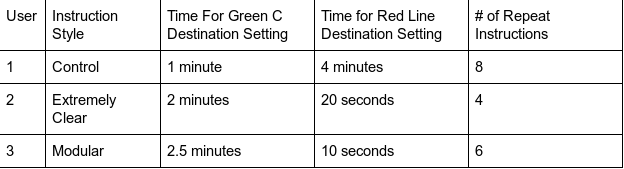

## Results of Formal Usability Test
### Overview

During the usability study, we focused on how different ways of presenting the instructions impacted how long it would take users 
to successfully set and navigate to their intended destinations. The test format itself was confusing because it might not have 
directly correlated to real life in how users interacted with it; both users were generally confused about the different input 
methods based on the audio instructions they received because the instructions were tailored for the actual experience instead of 
the wire frame. Based on this, we believe that the part of the longer initial learning time was a result of having to learn what 
the physical inputs meant for the test (using trackpad, mouse buttons, and arrow keys). 

Beyond those issues from the test format itself, we also observed some other issues that all three users ran into. They did not 
fully understand the instructions the first time they heard them, and had to listen to them repeatedly before comprehending all 
of the gestures. In the case of the control user, the instructions were not sufficient for a complete understanding of the 
interface as well as all of the relevant features without interference. However, the user that interacted with the “Extremely 
Clear” instructions that automatically played took longer to learn how to repeat the instructions by tapping and holding. The 
user that was prompted to tap and hold even for the first listening of the instructions did not encounter this same issue. 

Moreover, the control user showed frustration at the lack of clear instructions. Even when controls for the settings were 
explained, this user was frustrated with how non-intuitive instructions were. This user never figured out how to repeat 
instructions or confirm a destination selection. When they started navigation they complained about the lack of clear indication
of how far away the destination was. Despite this, once controls were explained the user was able to effectively navigate to the
destination.

Additionally, the two users presented with the more comprehensive, non-control instructions felt that there were too many
instructions to keep track of upon first hearing them, and that they were presented in an unintuitive order. User 2 specifically
recommended moving the first instruction of tapping and holding to repeat the instructions to the end of the list because that
would be more intuitive. The direction of “Follow your ears in the direction of the beep” unexpectedly lead to confusion for User
2 and 3 because their first direction was then “Turn Around” instead of a beep because they needed to turn 180 degrees and our 
test system would not be able to differentiate a beep directly in front of the user from one directly behind. 

### Key Observations

The users presented with more instructions took longer to learn the interface, but ultimately were more aware of all of the
features and functionality. This is an improvement over our previous model that did not explain or introduce them, leading users
to believe they did not exist at all. As for evaluating the best design of the longer instruction set styles, we looked at the
following metrics:

Based on our usability study results, we found that it took longer than expected for the users to successfully set their Green 
line destination for both non-control situations. This was a result of having more functions and gestures to learn, potentially 
more than is feasible to learn within one playback. In both cases, after the initial long period of time learning, the second 
time of completing the task was much much faster and all functions were understood by the user. This validates that these 
instructions increase feature awareness, and the tradeoff between that and the longer time to learn is probably worth it.

If we had conducted our study on a large population and found similar results to the ones we had, we would be fairly confident 
in choosing to use the modular style, which ultimately resulted in a faster secondary destination setting. Additionally, if all 
users with the “Extremely Clear” design were confused by the tap and hold instructions whereas the modular group was not, that 
would be another indication of that design being better. 

### Conclusions

Before the final demo, we will work on simplifying the instructions while retaining the informational content. We will go with 
the modular option of giving the first prompt of tapping and holding to play the instructions as this minimizes confusion in 
that area. We will then add the direction “Tap and hold to replay instructions” as the last instruction they hear, since this 
follows the standard format that users are more familiar with, making it more intuitive. If we have more time, we can also work 
on addressing the issue of beeping and the “Turn around” instruction, since this also was a particularly confusing part of the 
interface. We would need to find an alternative way to direct the user to spin 180 degrees. 

## [Homepage](index.md)
